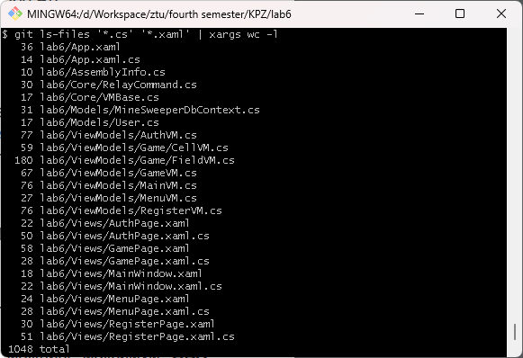

# 📋 Опис функціональності:
Проєкт: "Minesweeper"

Це реалізація класичної гри "Сапер" з авторизацією користувачів, створена з використанням C# WPF MVVM. Проєкт включає:

- Авторизацію/реєстрацію користувача

- UI: Вікна входу, реєстрації, меню, гри

- Саму гру Сапер

# Кількість рядків (1048)

# Демонстрація
[Скріншоти](./demo)

# Programming Principles

У проєкті дотримані наступні принципи програмування:

- SRP (Single Responsibility Principle) — кожен клас має чітко визначену відповідальність (наприклад, GameVM відповідає лише за логіку гри).

- OCP (Open-Closed Principle) — додавання нового функціоналу не вимагає змін у вже написаному коді.

# Design Patterns
У проєкті використані наступні патерни проєктування:

- MVVM (Model-View-ViewModel)

  Файли: MainVM.cs, GameVM.cs, AuthVM.cs
  
  Використовується для розділення логіки, UI та даних, що полегшує тестування і підтримку.

- Command Pattern

  Файли: RelayCommand.cs, використовується в ViewModels

  Для реалізації команд (кнопок) в UI, які можна прив’язати у XAML.

# Refactoring Techniques

Під час розробки застосовані такі техніки рефакторингу:

- Винесення повторюваного коду в окремі методи.

- Розбиття великих методів на дрібніші.

- Використання властивостей замість публічних полів.

- Використання інтерфейсів для абстракції залежностей.

- Оптимізація логіки перевірок і умов.

# Запуск

1. Клонуйте репозиторій

1. Відкрийте проєкт у Visual Studio 2022 або новішій версії.

1. Відновіть пакети NuGet (EntityFrameworkCore, EntityFrameworkCore.SqlServer, EntityFrameworkCore.Design).

1. Створіть БД виконавши наступні команди у папці з проектом:
   - dotnet ef migration add Initial
   - dotnet ef database update

1. Запустіть проект
